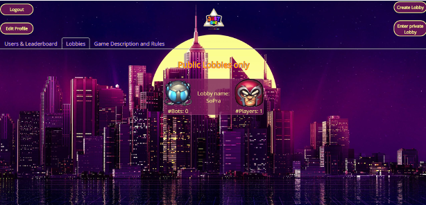
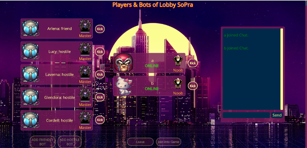
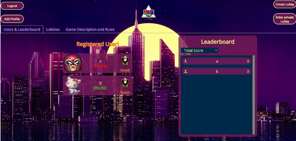

# Just One Web App - SoPra Group 13

This project started as part of the SoPra course. We wanted to create a web application for the 
popular board game Just One. The goal of the project is to allow people all over the world to play with each other.
additionally we wanted to create a competitive environment. To achieve that we implemented a automated scoring system
that uses NLP to check the validity of clues and a JPA database to store all scores of every player over all played 
games. The scores of all players are ranked on a public leaderboard. If a group wants more players they can add bots 
to the game. The bots use NLP to give either good or bad clues.

## How to setup and run this Project

For your local development environment you'll need Node.js >= 8.10. You can download it [here](https://nodejs.org). All other dependencies including React get installed with:

### `npm install`

This has to be done before starting the application for the first time (only once).

### `npm run dev`

Runs the app in the development mode. 
Open [http://localhost:3000](http://localhost:3000) to view it in the browser.

The page will reload if you make edits. 
You will also see any lint errors in the console (use Google Chrome!).

### `npm run test`

Launches the test runner in the interactive watch mode. 
See the section about [running tests](https://facebook.github.io/create-react-app/docs/running-tests) for more information.

### `npm run build`

Builds the app for production to the `build` folder. 
It correctly bundles React in production mode and optimizes the build for the best performance.

The build is minified and the filenames include the hashes. 
Your app is ready to be deployed!

See the section about [deployment](https://facebook.github.io/create-react-app/docs/deployment) for more information.

## Getting started with React

Read and go through those Tutorials, It will make your life easier!

- Read the React [Docs](https://reactjs.org/docs/getting-started.html)
- Get an Understanding of [CSS](http://localhost:3000) and [HTML](https://www.w3schools.com/html/html_intro.asp)!
- Learn Unity [Docs](https://docs.unity3d.com/Manual/index.html)!

There are three main external dependencies that you should look at:

- [react-unity-webgl](https://www.npmjs.com/package/react-unity-webgl) It lets unity communicate through react the framework

- [styled-components](https://www.styled-components.com/docs)
  It removes the mapping between components and styles (i.e. external css files). This means that when you're defining your styles, you're actually creating a normal React component.

- [react-router-dom](https://reacttraining.com/react-router/web/guides/quick-start) Declarative routing for React being a collection of navigational components that compose declaratively with your application. 

## Illustrations/UI Flow

As usual every user can create an account with and log in with its user name 
and password. After the login to the dashboard you can create your own lobby and set it
on public or private. On the tab "Public Lobbies" you can join public lobbies, which are not 
in the game yet or join a private lobby through a four ciphers password.

Important: There is no feature to communicate the four ciphers of a private lobby. Either
communicate orally or by third party tool.

Setup: It needs at least 3 players to join the game. One game contains a deck with 13 cards, 
therefore at most 13 topics.

As lobby creator/admin you can add/kick bots and kick players. An admin can only leave a lobby,
if you are the last player in the lobby. Player and bots have different behaviour. By "Join into Game"
you enter the game "Just One". Unity can take time to load all components and waits for all players until
all players has loaded. Please be patient. 

Important: Don't switch or close the tab. In that case you left the game and it is over.

When the game begins, you are either a guesser or clue giver:
Clue giver votes one topic of five and gives a clue related to the topic within 30s for
the guesser.
The guesser(/active player) waits for the clues. At this point there are three outcomes:
- guess the word; if it's correct, points will be calculated related to the amount of time
- guess the word; if it's wrong, then there will be no points and the current card and also
 an additional card will be discarded
- skip this round; there will be no points and only this current topic will be discarded

The application contains some features:
- ranking system; visualized by the picture and rank name, depending on the current score
- leaderboard
- editing profile (avatar choice, username)
- a short game description
- chat feature in the lobby

## Road Map
Possible features to enhance UX:
- add chat to the game
- additional language settings
- rejoin session after disconnect
- guest mode for spectactors

## Contributing
When contributing to this repository, please first discuss the change you wish to make via issue, email, or any other method with the owners of this repository before making a change.

Please note we have a code of conduct, please follow it in all your interactions with the project.

#### Pull Request Process
1. Ensure any install or build dependencies are removed before the end of the layer when doing a build.
2. Update the README.md with details of changes to the interface, this includes new environment variables, exposed ports, useful file locations and container parameters.
3. Increase the version numbers in any examples files and the README.md to the new version that this Pull Request would represent. The versioning scheme we use is [SemVer](https://semver.org/).
4.You may merge the Pull Request in once you have the sign-off of two other developers, or if you do not have permission to do that, you may request the second reviewer to merge it for you.
Code of Conduct
#### Our Pledge
In the interest of fostering an open and welcoming environment, we as contributors and maintainers pledge to making participation in our project and our community a harassment-free experience for everyone, regardless of age, body size, disability, ethnicity, gender identity and expression, level of experience, nationality, personal appearance, race, religion, or sexual identity and orientation.

#### Our Standards
Examples of behavior that contributes to creating a positive environment include:

- Using welcoming and inclusive language
- Being respectful of differing viewpoints and experiences
- Gracefully accepting constructive criticism
- Focusing on what is best for the community
- Showing empathy towards other community members
Examples of unacceptable behavior by participants include:

- The use of sexualized language or imagery and unwelcome sexual attention or advances
- Trolling, insulting/derogatory comments, and personal or political attacks
- Public or private harassment
- Publishing others' private information, such as a physical or electronic address, without explicit permission
- Other conduct which could reasonably be considered inappropriate in a professional setting
#### Our Responsibilities
Project maintainers are responsible for clarifying the standards of acceptable behavior and are expected to take appropriate and fair corrective action in response to any instances of unacceptable behavior.

Project maintainers have the right and responsibility to remove, edit, or reject comments, commits, code, wiki edits, issues, and other contributions that are not aligned to this Code of Conduct, or to ban temporarily or permanently any contributor for other behaviors that they deem inappropriate, threatening, offensive, or harmful.

#### Scope
This Code of Conduct applies both within project spaces and in public spaces when an individual is representing the project or its community. Examples of representing a project or community include using an official project e-mail address, posting via an official social media account, or acting as an appointed representative at an online or offline event. Representation of a project may be further defined and clarified by project maintainers.

#### Enforcement
Instances of abusive, harassing, or otherwise unacceptable behavior may be reported by contacting the project team at sopra13group@gmail.com. All complaints will be reviewed and investigated and will result in a response that is deemed necessary and appropriate to the circumstances. The project team is obligated to maintain confidentiality with regard to the reporter of an incident. Further details of specific enforcement policies may be posted separately.

Project maintainers who do not follow or enforce the Code of Conduct in good faith may face temporary or permanent repercussions as determined by other members of the project's leadership.

#### Attribution
This Code of Conduct is adapted from the [Contributor Covenant](https://www.contributor-covenant.org/), version 1.4, available at https://www.contributor-covenant.org/version/1/4/code-of-conduct/

## Authors
Simon Padua (IsaacTheII)

Chris Aeberhard (niddhog)

Thanh Huynh (Tharoxes)
   
Ivan Allinckx   (iallin)
   
Marc Kramer (Makram95)

## Acknowledgement

Art for Dashboard

Artist: Literal Lemon (https://steamcommunity.com/id/LiteralLemon) 

Pixel Art for Unity Game
    
Artist: Colletior (https://steamcommunity.com/id/colletior)

Artist: Akito One (https://steamcommunity.com/id/akito_one)

## License
Copyright (c) [2020] [Sopra Group13]

Permission is hereby granted, free of charge, to any person obtaining a copy
of this software and associated documentation files (the "Software"), to deal
in the Software without restriction, including without limitation the rights
to use, copy, modify, merge, publish, distribute, sublicense, and/or sell
copies of the Software, and to permit persons to whom the Software is
furnished to do so, subject to the following conditions:

The above copyright notice and this permission notice shall be included in all
copies or substantial portions of the Software.

THE SOFTWARE IS PROVIDED "AS IS", WITHOUT WARRANTY OF ANY KIND, EXPRESS OR
IMPLIED, INCLUDING BUT NOT LIMITED TO THE WARRANTIES OF MERCHANTABILITY,
FITNESS FOR A PARTICULAR PURPOSE AND NONINFRINGEMENT. IN NO EVENT SHALL THE
AUTHORS OR COPYRIGHT HOLDERS BE LIABLE FOR ANY CLAIM, DAMAGES OR OTHER
LIABILITY, WHETHER IN AN ACTION OF CONTRACT, TORT OR OTHERWISE, ARISING FROM,
OUT OF OR IN CONNECTION WITH THE SOFTWARE OR THE USE OR OTHER DEALINGS IN THE
SOFTWARE.

>Thanks to Lucas Pelloni and PurpleBooth for the templates
